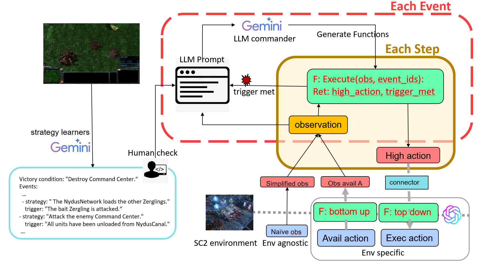

# Learning Human-like Strategies for Multi-agent Cooperation in StarCraft II

## 0. 简介 (Introduction)

本仓库包含“学习星际争霸II中多智能体协作的类人策略”项目的代码，该项目基于 [SMAC](https://github.com/oxwhirl/smac) 环境构建。

本项目是北京大学“强化学习”课程的期末项目。

我们的主要贡献包括：
* 在 **HLSMAC** 基准的高级地图上进行了实验，包括 12 张具有人类设计策略的挑战性地图。
* 基于 Qatten 改进的训练算法 -- **Qatten2**。
* 实现了一个集成了大语言模型（LLM）的 **智能体框架 (Agent Framework)**。

智能体框架的流程图如下：


## 1. 环境搭建 (Environment Setup)

以下是在 Linux 上搭建项目开发环境的指南。如果您使用的是 Windows，只需从 Battle.net 下载并安装《星际争霸 II》即可。

基于课程作业的说明，您可以通过以下步骤搭建环境：
1. 将本仓库克隆到本地机器。
   ```bash
   git clone --depth 1 https://github.com/Minechuan/HLmarl.git
   pip install -e smac/
   ```
2. 从 [github repository](https://github.com/Blizzard/s2client-proto) 下载 SC2（Linux 版本）。解压下载的文件，并将解压后的文件夹（例如 ``StarCraftII``）放置在本仓库的 ``3rdparty`` 目录下（提示：解压密码在 README.md 中）。

3. 找到 SC2 的安装路径，例如 ``/path/to/StarCraft II/``。将 ``StarCraft2_HLSMAC\Tactics_Maps\HLSMAC_Maps`` 中的 **12** 个地图文件移动到 ``/path/to/StarCraft II/Maps/Tactics_Maps``（如果目录不存在请自行创建）。使用以下命令检查现有地图：
   ```
   python -m smac.bin.map_list
   ```

4. 其他所需的包可以通过以下命令安装：
   ```bash
   pip install -r requirements.txt
   ```

完成这些步骤后，您可以通过运行仓库中提供的简单测试脚本或执行一个简单的训练运行来验证安装。

```bash
python src/main.py --config=qatten --env-config=sc2te with env_args.map_name=sdjx_te use_tensorboard=False save_replay=False save_model=False runner=episode batch_size_run=1
```

上述命令仅保存 sacred 日志，仅用于测试环境是否工作正常。如果您正在调试，可以添加 ``--no-save`` 以避免保存 sacred 日志。

## 2. 运行实验 (Run the Experiments)

### 2.1 测试我们需要训练好的算法 (Learner)：

**测试 Qatten2**（使用 ``checkpoints/qatten2`` 中提供的检查点）：

> 我们保存了胜率不低于 30% 的检查点。从 [gmzz_te, sdjx_te, swct_te, jdsr_te, wwjz_te, wzsy_te] 中选择 $NAME$

```bash
python src/main.py --config=qatten2 --env-config=sc2te with env_args.map_name=$NAME$ checkpoint_path=./checkpoints/qatten2/$NAME$ test_nepisode=32 save_replay=True runner=episode save_model=False use_tensorboard=False evaluate=True batch_size_run=1
```

**测试智能体框架 (Agent Framework)**：

首先检查 API 是否工作正常：

```bash
python check_api.py
```

如果您想使用自己的 API，请修改 ``src/config/algs/llm_dhls.yaml``。

随后在一个地图上运行智能体框架：

> 由于时间限制，我们仅支持以下地图。如果您想测试其他地图，请参考 RUN_AGENT.md 更改必要的配置。

```bash
python src/main.py --config=llm_dhls --env-config=sc2te with env_args.map_name=dhls_te use_tensorboard=False runner=agent save_replay=True --no-save use_agent_framework=True
```

### 2.2 运行您自己的实验：

* 如果您想使用强化学习训练自己的智能体，请参考 [RUN_RL.md](./documents/RUN_RL.md)。
* 如果您想在其他地图上测试具有类人策略的智能体，请参考 [RUN_AGENT.md](./documents/RUN_AGENT.md)。

## 3. 录制演示视频和回放 (Record demonstration videos and replays)

1. 在命令行中设置 ``save_replay=True`` 以在测试期间保存回放。
2. 从 ``3rdparty/StarCraftII/Replays`` 下载回放文件。
3. 复制到安装了《星际争霸 II》的 Windows 机器上。详细的路径规则类似于助教的指南。

## 4. 常见问题 (Issues)

**路径错误 (Path error)**：找不到 SC2 路径。

复制到类似 pymarl 的目录中，因为每个类似 pymarl 的仓库通常需要以自己的方式安装星际争霸。或者在配置文件或代码中手动设置 SC2 路径。

或者将 SC2 路径链接到目标路径：

```bash
ln -s $StarCraftII_path$ ./3rdparty/StarCraftII
```

**回放错误 (Replay Error)**：
```
ValueError: Unknown game version: 4.10.0. Known versions: ['latest']
```
Linux 的回放版本较旧。双击回放文件。游戏会自动安装旧版本。

如果无法打开：

```bash
# 检查回放版本
python -m pysc2.bin.replay_version  .\jctq_te.SC2Replay
```
例如：Version(game_version='5.0.14', build_version=94137, data_version='519EE8D06E384469C652DD58FC6016AC', binary=None)

```python
# 更新 pysc2
# F:\project\Anaconda3\anaconda\envs\smac_env\Lib\site-packages\pysc2\run_configs\lib.py
# 追加以下内容

Version("5.0.14", 94137, "519EE8D06E384469C652DD58FC6016AC", None),
```
